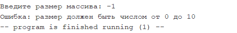
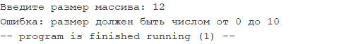
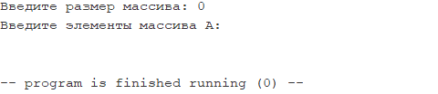
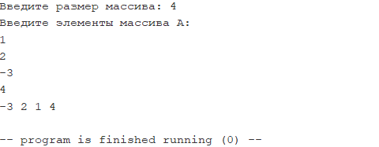
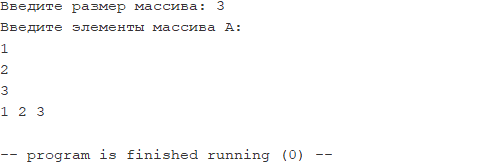
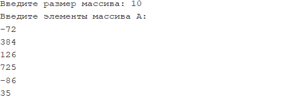
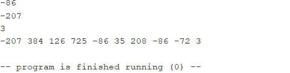
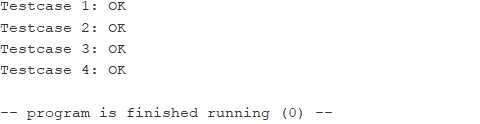

# ИДЗ №1

**Выполнил:** Тимергалин Тимур Маратович, группа БПИ227

## Запуск

Компиляция производилась со флагом "Initialize program counter to global 'main' if defined" (и никакими другими) 

## Условие

**Вариант 20:** Сформировать массив B из элементов массива A перестановкой местами минимального и первого элементов.

## Решение

### Содержание

**Внимание:** эмулятор *RARS* работает с файлами кодировки *cp1251*, которая некорректно отображается в браузере. Скриптом  *convert_encoding.py* файлы были перекодированы в *utf-8*, результат лежит в папке *utf8*.

Решение состоит из следующих файлов:

- **mfunc.inc** - макрос-библиотека с одним макросом `func`, предназначенным для автоматической генерации определений подпрограмм.

- **convenience.inc** - макрос-библиотека для "quality-of-life" макросами - 2 вариации макроса `exit` для завершения работы программы.

- **io.inc** - библиотека макросов (и, формально, подпрограмм), в которой реализована функциональность ввода/вывода массивов, а именно подпрограммы:

  - `_input`, считывающая массив из консоли и возвращающая его размер;
  - `_print`, выводящая содержимое массива в консоль;

  Для каждой вышеперечисленной подпрограммы написан макрос их вызова.

- **idz1.inc** - библиотека макросов (и, формально, подпрограмм), в которой реализована вся содержательная часть домашнего задания, а именно подпрограммы:

  - `_createB`, копирующая содержимое одного массива в другой, параллельно ища адрес минимального массива в результирующем массиве, и возвращающая этот адрес;
  - `_swap`, меняющая местами первый элемент массива и элемент по данному адресу;

  Для каждой вышеперечисленной подпрограммы написан макрос их вызова. Также в библиотеке представлен макрос `mmain`, выполняющий поставленную в условии задачу на заранее созданном массиве.

- **idz1.asm** - основной исполняемый файл, осуществляющий ввод массива из консоли, выполнение поставленной задачи и вывод результата в консоль.

- **idz1_test.asm** - файл с тестами. В нем представлены 4 тестовых случая, а также реализованы следующие компоненты:

  - Подпрограмма `_compare`, проверяющая пару массивов на поэлементное равенство, а также макрос для её удобного вызова;
  - Макрос `testcase`, запускающий проверку корректности программы на определенных входных данных.

### Соответствие решения требованиям

Представленное решение подразумевает оценку в 10 баллов.

#### Критерии на 10 баллов

- Программа разбита на отдельные файлы (единицы компиляции), при этом функциональность ввода/вывода представлена единым модулем (**io.inc**);
- Макросы вынесены в отдельные библиотеки (технически, в библиотеках присутствуют определения подпрограмм, но они сгенерированы автоматический, вынесение их генерации в отдельный файл было найдено неуместным).

#### Критерии на 9 баллов

- В программе используются макросы;
- Тела всех подпрограмм реализованы с помощью макросов.

#### Критерии на 8 баллов

- Разработанные подпрограммы поддерживают многократное использование (например, они применяются как в **idz1.asm**, так и в **idz1_test.asm**);
- Автоматическое тестирование реализовано в **idz1_test.asm**.

#### Критерии на 6-7 баллов

- Разработаны подпрограммы с передачей параметров (все подпрограммы в решении принимают хотя бы один аргумент), значение регистра `ra` сохраняется на стеке в соответствии с конвенцией;
- Подпрограммы сохраняют локальные переменные на стеке (эта функциональность реализована в **mfunc.inc**, в коде макроса `func` реализовано сохранение `s`-регистров на стек. Реализация была "закомментирована" за ненадобностью в данном решении);
- Комментарии о принимаемых и возвращаемых значениях присутствуют (они были размещены при описании подпрограмм, а не при их вызове).

#### Критерии на 4-5 баллов 

- Представлено решение задачи на языке ассемблера, полностью покрытое тестами (см. "Результаты запуска и тестирования" ниже).

## Результаты запуска и тестирования

### id1.asm

 

---

 

---

 

---

 

---

 

---

 

 

### idz1_test.asm

 
